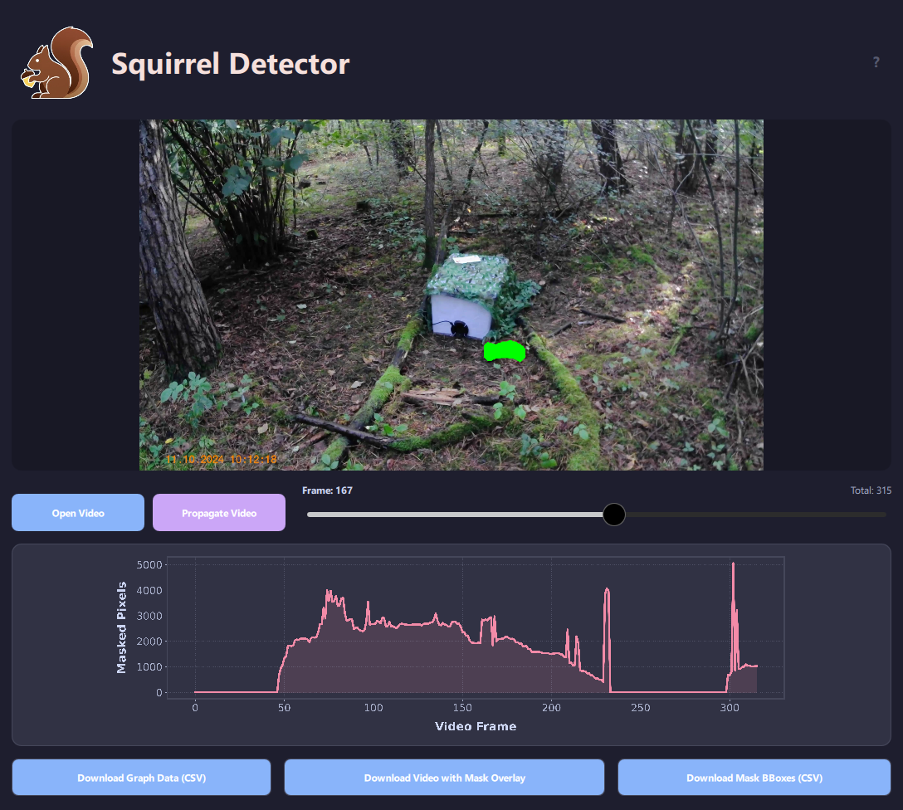

# Squirrel Detector
*Part of the [Squirrels in Town](https://github.com/darianwwu/Squirrels/blob/main/README.md) study project — Group 3: Jan Becker, Deekshita Ram, Darian Weiß*

*Author of this application: Jan Becker (<jbecker8@uni-muenster.de>)*

---

Squirrel Detector is an application built directly on the SAM3 model. A dedicated class provides access for performing segmentation with the SAM3 model. Furthermore, it provides several functions to export result data. The intuitive and user-friendly GUI, shown below, is built with the Qt framework. It provides a smooth and visually clear interface, allowing users to interact with the segmentation process and view results while keeping the computational logic separate.

<p align="center">
  
</p>

## Overview
Squirrel Detector offers the following functionalities:
- Load a video
- Segment squirrels on selected frames
- Segment squirrels across video
- Visualize mask area changes over time
- Export graph data (CSV)
- Export processed video with mask
- Export mask bbox data


## Project Structure

```bash
Squirrel-App/
│
├── UI/
│ ├── main.qml
│ └── assets/
│
├── splash.py
├── sam3_segmenter.py
├── main.py
├── requirements.txt
└── README.md
```


## Installation & Setup

### 1. Clone the repository

```bash
git clone https://github.com/janbecker2/Squirrel-App.git
cd Squirrel-App
```
### 2. Install dependencies
```bash
# If you have an RTX 50-series GPU or SAM3 does not run on your GPU, install the compatible PyTorch build first:
pip install --pre --force-reinstall torch torchvision --index-url https://download.pytorch.org/whl/nightly/cu128

# Then install the remaining dependencies:
pip install -r requirements.txt
```

### 4. Set up Hugging Face Authentication
Create a .env file in the root directory and add your Hugging Face API token:
```bash
HF_TOKEN="your_hugginface_api_key"
```
The application will automatically authenticate with Hugging Face when it starts.

You can generate a token here:
https://huggingface.co/settings/tokens

Note: Make sure you have requested and been granted access to the required model repository before generating your token.

### 5. Run the application
```bash
python main.py
```
---

### Usage of the Sam3VideoSegmenter Class 
> **Note:** You can also use the `Sam3VideoSegmenter` class directly in Python scripts **without using the GUI**:  

```python
from segmenter import Sam3VideoSegmenter

# Initialize the segmenter
segmenter = Sam3VideoSegmenter()

# Load video
segmenter.load_video("video.mp4")

# Add text prompt for segmentation
segmenter.add_text_prompt("squirrel")

# Propagate masks across all frames and show using 
frames = segmenter.propagate_video(show_live=True)

# Export results
segmenter.export_video(frames, "output.mp4")
segmenter.export_graph_csv("mask_area.csv")
segmenter.export_mask_csv("mask_bboxes.csv")
